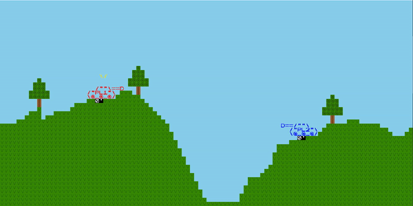
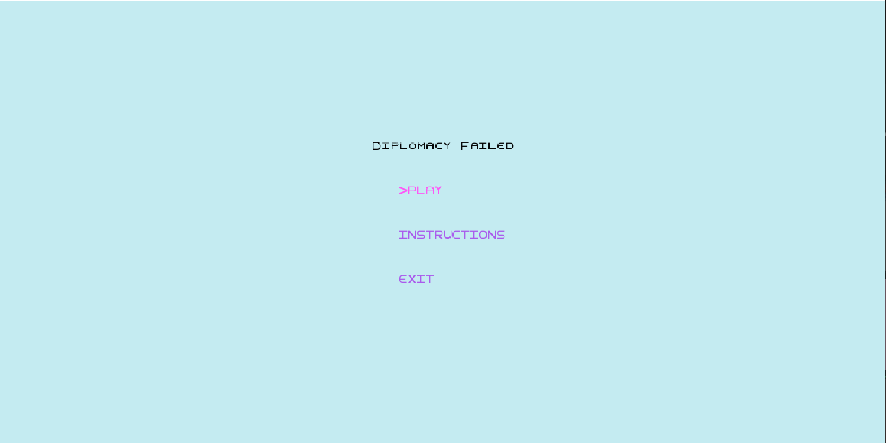
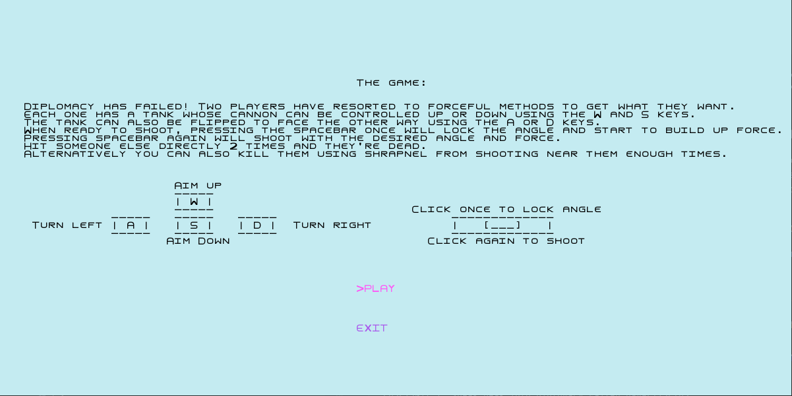
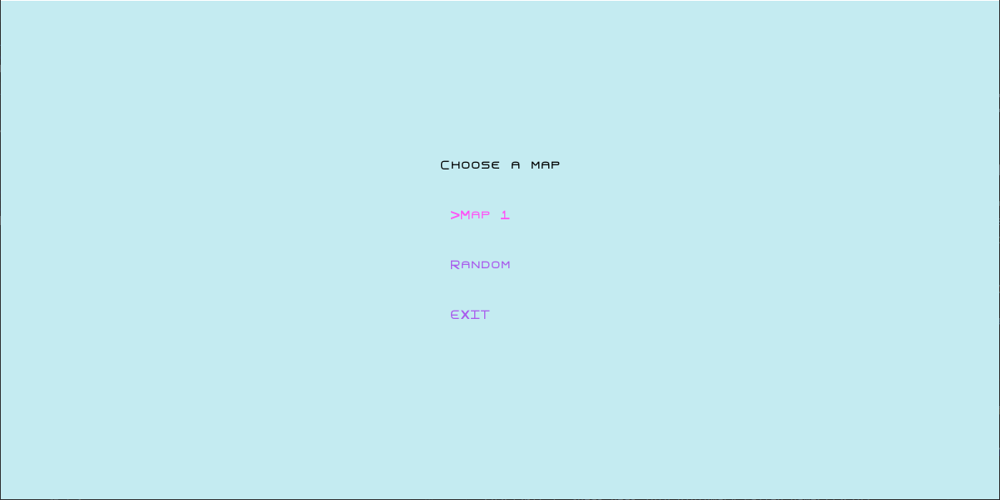
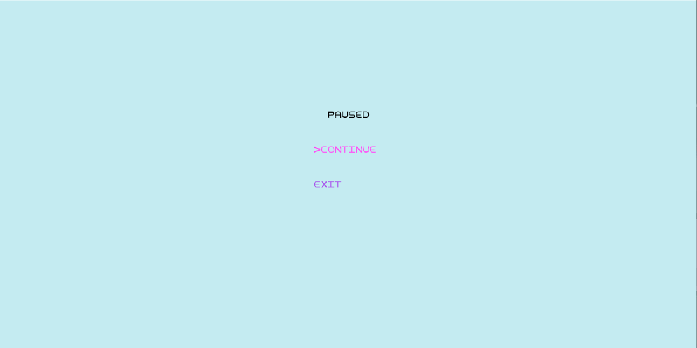
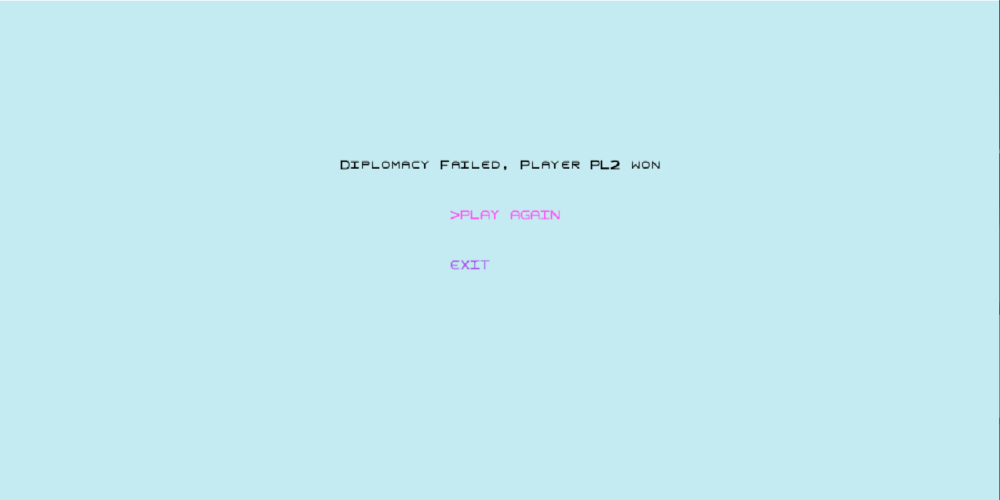
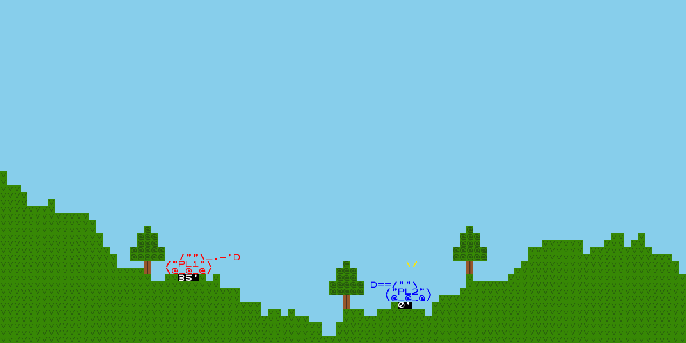
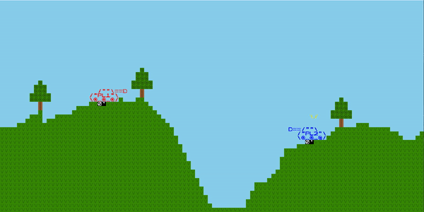

# LDTS_T09_G07 - Diplomacy Failed

## Game Description

Diplomacy Failed is a turn based game where you have to shoot your opponent's tank before they shoot yours.
Each map only differs on terrain, which means, the difficulty will only depend on how good your sharpshooting skills are.

This project was developed by
João Matos (up202006285@edu.fe.up.pt) and
Gustavo Costa (up202004187@edu.fe.up.pt)
for LDTS 2021-22.

For a more detailed version of this description click [here](./docs/README.md).

## Screenshots

The following screenshots ilustrate the general look of our game, as well as the divergent functionalities:
### Game preview

  

  <b><i>Gif 1. Sneak peak into Diplomacy Failed game</i></b>

 
 

### Menus

  

  <b><i>Fig 1. Main Menu </i></b>

  

 
 

  

  <b><i>Fig 2. Instructions Menu </i></b>  

  

 
 

  

  <b><i>Fig 3. Choose Map Menu </i></b>  

  

 
 

  

  <b><i>Fig 4. Pause Menu </i></b>

  

 
 

  

  <b><i>Fig 5. Game Over Menu </i></b>

  

 
 

### Maps

  

  <b><i>Fig 6. Map 1 </i></b>

 
 

  

  <b><i>Fig 7. Randomly Generated Map </i></b>

 
 

### Animations

  

  <b><i>Gif 2. Tank shooting</i></b>

 
 

  

  <b><i>Gif 3. Shell exploding</i></b>

 
 

  

  <b><i>Gif 4. Tree falling </i></b>

