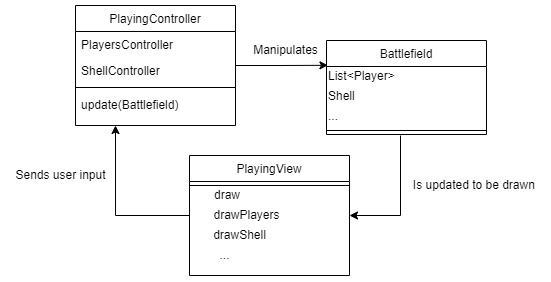
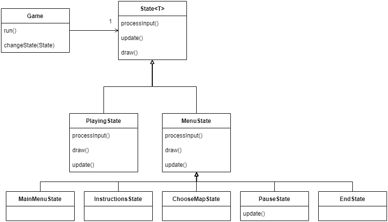
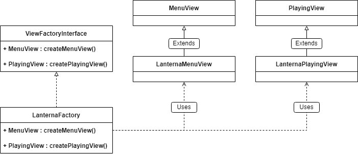
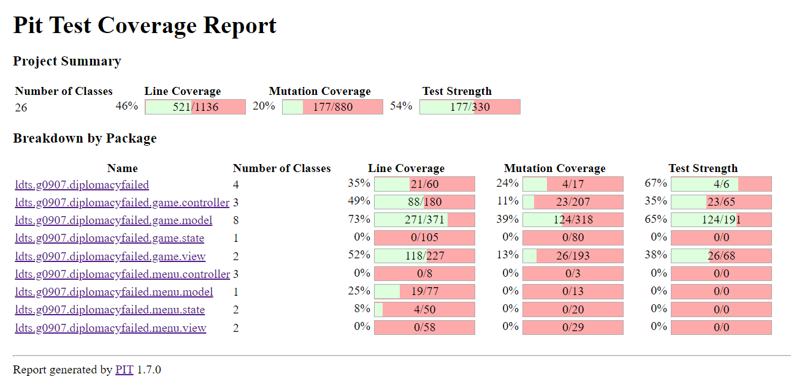

# LDTS_T09_G07 - Diplomacy Failed

## Game Description

Diplomacy Failed is a turn based game where you have to shoot your opponent's tank before they shoot yours. Each map only differs on terrain, which means, the difficulty will only depend on how good your sharpshooting skills are.

This project was developed by João Matos ([up202006285@edu.fe.up.pt](mailto:up202006285@edu.fe.up.pt)) and Gustavo Costa ([up202004187@edu.fe.up.pt](mailto:up202004187@edu.fe.up.pt)) for LDTS 2021-22.

## Implemented Features

- **Object loading from file** - Maps can be loaded and displayed, as well as tanks and trees.
- **Tree and tank falling** - Trees and tanks are capable of falling until hitting the ground.
- **Shell trajectory calculation** - The shell is shot and perfectly describes a parabola until hitting the terrain, a tank or flying out of bounds.
- **Cannon head inclination** - The cannon head can be inclined at an angle between 0º and 180º.
- **Tank flipping and walking** - The player can flip their tank left or right and walk a maximum of 5 steps per round. The tanks can go up one block when moving right or left.
- **Explosion animation and sound** - The shell fired from the tanks explodes on impact displaying a short animation and reproducing a short audio.
- **Connected Menus** - The user has the capability of browsing through the different menus including in game ones. (Ex: Main Menu, Play, Instructions).
- **Buttons** - Functional and interactive buttons. An arrow points to the currently selected option. You can also confirm your selection by pressing Enter.
- **Keyboard control** - There is no mouse input. Keyboard inputs are received through the respective events and interpreted according to the current game state.
- **Player control** - The player may move his cannon with the keyboard (W, S / ArrowUp, ArrowDown) and choose the force applied to the tank shell with Spacebar. After the second Spacebar click, the shell is shot were aimed at. They can move horizontally (A,D / ArrowLeft, ArrowRight)
- **Collisions detection** - Collisions between the shell and the terrain and between the shell and tanks are taken into consideration. There is no collision with trees, on purpose, they are decoration and fall when the ground beneath is destroyed.
- **Different levels** - The player can choose to play on a predefined map or randomly generate a new one.
- **Animations and SFX** - There as several animations, as mentioned above, like entities falling, players changing color to reflect their current health, shells exploding and terrain being destroyed. There's also a little sound effect for when a shell explodes.

## Planned Features

Sadly, we weren't able to add sound effects everywhere on the game.

We'd like to have the following ones:
<ul>
    <li>When changing selected buttons on the different menus;</li>   
    <li>A nice background music;</li>
    <li>A sound for when the tanks move, change cannon inclination and shoot.</li> 
</ul>

Also thought about having the following visual effects:
<ul>
    <li>A little cloud moving in the background of the battlefield, but that really wasn't a priority;</li>
    <li> Synthwave background and color scheme. </li>
</ul>
    
## Design Patterns

### General Structure
#### Problem in Context:
The first concern of our project was how the structure would look like. Since our game is dealing with a GUI and is divided by different Game States some specific patterns came to mind in order to fulfil our needs the best way possible.

#### The Pattern:
Two main patterns were applied to the project, the **_Architectural Pattern_**, more specifically the Model-View-Controller style which is commonly used in a GUI and the **_State Pattern_** which is a behavioral design pattern that lets an object alter its behavior when its internal state changes.

#### Implementation:
Regarding the implementation, we now have classes which main purpose is to store data (model), classes that control the logic of the game (controllers) and classes that are responsible for the visual effects on the screen (views), these types of classes associate with each other in the following manner:

  

  <b><i>Fig 1. Model-View-Controller design pattern</i></b>

As for the different states, they are divided with the same methodology as the MVC style, and allow the game to alter its behavior in a simple and efficient way.

  

  <b><i>Fig 2. State design pattern</i></b>

#### Consequences:
The use of these patterns in the current design allow the following benefits:
 - The several states that represent the different menus become explicit in the code, instead of relying on a series of flags.
 - Easy to add new features throughout the development stage.
 
### Graphical User Interface
#### Problem in Context:
Our code needed to be independent of the GUI used. This is partly because we could need to change it, someday, but also because different components need to interact differently with the same GUI, without messing the others up.

#### The Pattern:
To solve this issue, a **_Creational Design Pattern_** was used, more specifically, the Abstract Factory design pattern. It lets us create families of related objects without specifying their concrete classes.
#### Implementation:
By creating an abstract factory for the GUI, we can have specific GUI's for the Menu and the Game itself.

  

  <b><i>Fig 3. Abstract Factory design pattern</i></b>

#### Consequences:
We can be sure that what's produced by the abstract factories is compatible with the rest of the code. 
However, the code itself becomes more complicated to understand because a bunch of extra interfaces and classes are needed to pull this off.

### Other minor problems
#### Observer pattern
We needed the game to reflect the current active state, so we implemented a variation of the Observer pattern that lets us change the state whenever needed.

#### Game loop pattern
The Game loop pattern is almost mandatory in any game since the screen needs to be constantly refreshing.

## Known Code Smells And Refactoring Suggestions
#### **Large methods**
Some of our methods are very large due to their own nature. Since we have to draw multiple objects that depend on multiple conditions we need to have a lot of conditional branches that we can't really shorten. With this said, the solution to reduce the size each method boils down to the individual method itself, so we cannot give a generic approach.

#### **Bad dependencies and poor early choices**
It's common knowledge that when using MVC patterns, the controller should handle the logical operations. Due to bad early design choices, our Battlefield.java class has some methods that should belong to a controller. We were able to extract some of those methods but others are so deeply rooted that extracting them is a nightmare and would probably require a large portion of our code to be refactored.

#### **Poorly centered text**
The text in the menus is the very first thing the user sees and, unfortunately, is not near perfection. Centering all the buttons and text is not easy because we're using state patterns, which means that the centering method has to work for every single MenuState, without being MenuState specific. Honestly, the solution to this is probably either trial and error (which was a bit of what was done) or a mathematical formula that takes into consideration relative position, no matter how large the individual components are. Sadly, relative positioning is very hard because Lanterna is limited on it's capabilities.  

## Testing

For code testing, two main ways were used:  
-Spock, for game testing 
-JUnit/Mockito, for menu testing 

### Mutation Testing Report
We could not get PITest to work with both JUnit/Mockito tests and Spock tests. 
When we try to run both at once, it failed. We then tried to run it with just the Spock tests and it worked (mutation test report bellow) and then tried to run it with just the JUnit/Mockito tests and it showed no tests.  
We don't know how to fix this and it's already too late to ask for a professional's help so Spock mutation testing report is all we got. 

  

  <b><i>Fig 4. Mutation Testing Report main Page</i></b>

### Link to test mutations report
[Mutations Coverage](/docs/mutation/pitest/index.html)

### Coverage Report

  

  <b><i>Fig 5. Coverage Report Main Page </i></b>

### Link to coverage testing report
[Tests Coverage](/docs/coverage/index.html)

### Better Code Hub compliance badge

## Self-evaluation

The project's original idea was for it to be made by 3 people but we're only 2. 
Obviously, each one of us had more work to do than we would've had if we had a third person onboard. 
However, we can say confidently, that the work went smoother because it's far easier to coordinate 2 people than it is to coordinate 3. 
With this said, the work was not perfectly split between us and the distribution could be translated as follows: 

-João Matos: 55% 
-Gustavo Costa: 45%
